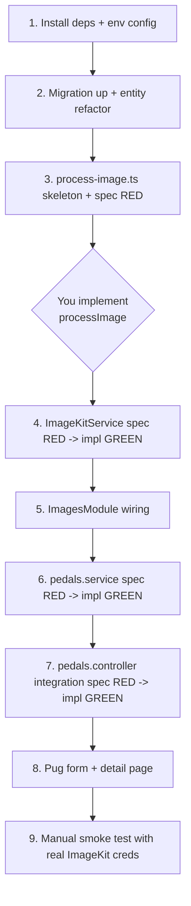

## Scope

All work in `[../loomernescent.v2](../loomernescent.v2)`. Pedals first; the helper + service are shared so albums/bands plug straight in later.

## 1. Dependencies & config

Add to `package.json`:

- `sharp` (image processing)
- `imagekit` (server SDK)
- `multer` + `@types/multer` (multipart parsing — `@nestjs/platform-express` re-exports `FileInterceptor` but multer is a peer dep)
- `uuid` + `@types/uuid` (filename suffix to guarantee uniqueness)

Add ImageKit env vars to `.env.example` and read via existing `@nestjs/config`:

- `IMAGEKIT_PUBLIC_KEY`
- `IMAGEKIT_PRIVATE_KEY`
- `IMAGEKIT_URL_ENDPOINT`

## 2. Shared image helper — `src/common/images/`

### `process-image.ts` (you implement — I leave bare)

I'll commit only the signature, types, and a `throw new Error('Not implemented')` body. You fill in the sharp pipeline.

```typescript
export interface ProcessImageOptions {
  /** Largest allowed edge in pixels. Default 2000 (2026 sweet spot for ImageKit-derived web display at retina 2x). */
  maxDimension?: number;
  /** When set, output is cropped (cover, centre) to exactly this ratio. */
  aspectRatio?: { w: number; h: number };
  /** Output format. Default 'jpeg'. */
  format?: 'jpeg' | 'png';
  /** JPEG quality 1–100. Default 85. Ignored for PNG. */
  quality?: number;
}

export interface ProcessedImage {
  buffer: Buffer;
  format: 'jpeg' | 'png';
  width: number;
  height: number;
  bytes: number;
}

export async function processImage(
  input: Buffer,
  opts: ProcessImageOptions = {},
): Promise<ProcessedImage>;
```

### `process-image.spec.ts` (I write — runnable A/C)

Each `it` is one acceptance criterion. Fixtures are synthesised with `sharp({ create: ... })` so no binary files are committed.

- **Output format**
  - defaults to JPEG (returned `format === 'jpeg'`, JPEG SOI bytes `0xFF 0xD8`)
  - converts a BMP input buffer to JPEG by default
  - converts a PNG input buffer to JPEG by default
  - honours `format: 'png'` (returned `format === 'png'`, PNG magic `0x89 0x50 0x4E 0x47`)
- **Resize / max dimension**
  - with no `aspectRatio`, scales 4000×3000 down to 2000×1500 at `maxDimension: 2000` (long edge wins)
  - with no `aspectRatio`, leaves a 1200×900 image untouched at `maxDimension: 2000` (no upscaling)
  - with no `aspectRatio`, honours `maxDimension: 800`
- **Aspect ratio crop**
  - with `aspectRatio: { w: 1, h: 1 }` on a 1600×900 input, output is square
  - with `aspectRatio: { w: 1, h: 1 }` + `maxDimension: 800`, output is 800×800
  - with `aspectRatio: { w: 16, h: 9 }` on 2000×2000 + `maxDimension: 2000`, output is 2000×1125
  - with `aspectRatio: { w: 1, h: 1 }` on portrait 800×1200, output is 800×800 (cover crop)
- **Quality**
  - `quality: 60` produces a strictly smaller buffer than `quality: 95` for the same JPEG input
  - default quality is 85 (`processImage(buf)` produces the same bytes as `processImage(buf, { quality: 85 })`)
  - PNG output ignores `quality` (passing `quality: 50` and `quality: 95` produces identical buffers)
- **Errors**
  - rejects when `input` is not a decodable image (`Buffer.from('not an image')`)

### `image-kit.service.ts` (I TDD)

```typescript
@Injectable()
export class ImageKitService {
  constructor(private readonly config: ConfigService) { /* construct ImageKit client */ }

  upload(input: { buffer: Buffer; filenameHint: string; folder: string })
    : Promise<{ fileId: string; filePath: string }>;

  delete(fileId: string): Promise<void>;            // idempotent (swallows 404)

  buildUrl(filePath: string, transforms?: { w?: number; h?: number; fo?: 'auto' | string }): string;
}
```

Tests (`image-kit.service.spec.ts`) mock the `imagekit` SDK via `jest.mock('imagekit')`:

- `upload` calls `imagekit.upload({ file, fileName, folder })` with `fileName = ${slugify(filenameHint)}-${uuid}.${ext}` and returns `{ fileId, filePath }` from the SDK response
- `upload` propagates SDK errors
- `delete` calls `imagekit.deleteFile(fileId)`
- `delete` swallows a 404 from the SDK (idempotent on already-deleted)
- `delete` re-throws any other error
- `buildUrl(path)` returns `${urlEndpoint}${path}` (no query)
- `buildUrl(path, { w: 800, h: 800, fo: 'auto' })` produces an ImageKit URL with `tr=w-800,h-800,fo-auto`

### `images.module.ts`

```typescript
@Module({
  providers: [ImageKitService],
  exports: [ImageKitService],
})
export class ImagesModule {}
```

`pedals.module.ts` imports `ImagesModule` so `PedalsController` can inject `ImageKitService`. (Albums/bands later.)

## 3. Migration & entity

Generate a new migration that:

- `ALTER TABLE pedals DROP COLUMN image`
- `ALTER TABLE pedals ADD COLUMN image_file_id text`
- `ALTER TABLE pedals ADD COLUMN image_path text`

`pedal.entity.ts` swaps:

```typescript
@Column({ name: 'image_file_id', nullable: true })
imageFileId: string | null;

@Column({ name: 'image_path', nullable: true })
imagePath: string | null;
```

Safe destructive drop because pedals CRUD shipped without uploads (`image` is empty in main + test branches).

## 4. Pedals controller — multer + upload flow (I TDD)

Two POSTs gain `@UseInterceptors(FileInterceptor('image', multerOpts))` where `multerOpts`:

- `storage: memoryStorage()`
- `limits: { fileSize: 10 * 1024 * 1024 }` (10 MB hard cap, multer rejects pre-sharp)
- `fileFilter`: only `image/*` mimetypes

Flow inside `create` / `update`:

1. Existing inline body validation runs first.
2. If `req.file` is present:
   - `processed = await processImage(file.buffer, { maxDimension: 2000, aspectRatio: { w: 1, h: 1 }, format: 'jpeg', quality: 85 })`
   - `{ fileId, filePath } = await imageKit.upload({ buffer: processed.buffer, filenameHint: slug, folder: 'pedals' })`
   - Pass `{ imageFileId: fileId, imagePath: filePath }` through to `pedalsService.create` / `update`.
3. On `update` with a new file: capture `oldFileId` first, save, then fire-and-forget `imageKit.delete(oldFileId)` (best-effort, logged on failure).
4. On `destroy`: best-effort `imageKit.delete(pedal.imageFileId)` after entity delete.

`pedals.service.ts` extends `CreatePedalInput` / `update` to accept optional `imageFileId` + `imagePath`.

## 5. Form + display

`[views/mixins/_pedalForm.pug](../loomernescent.v2/views/mixins/_pedalForm.pug)`:

- Add `enctype="multipart/form-data"` to the `form` tag.
- Add `input(type="file" id="image" name="image" accept="image/*")`.
- If `pedal.imagePath`, show a small preview using a Pug-side helper that wraps `ImageKitService.buildUrl(path, { w: 200, h: 200, fo: 'auto' })`. Helper added to `[src/common/helpers/template-helpers.ts](../loomernescent.v2/src/common/helpers/template-helpers.ts)` and exposed via `[src/common/middleware/template-locals.middleware.ts](../loomernescent.v2/src/common/middleware/template-locals.middleware.ts)` (existing pattern).

`[views/pedal.pug](../loomernescent.v2/views/pedal.pug)`: render image via the same helper at a larger size (e.g. `w-800,h-800,fo-auto`).

## 6. Tests

### Unit (existing pattern — `src/**/*.spec.ts`)

- `process-image.spec.ts` — see A/C above (you'll run this red→green).
- `image-kit.service.spec.ts` — SDK mocked.
- Extend `[pedals.service.spec.ts](../loomernescent.v2/src/pedals/pedals.service.spec.ts)`:
  - `create` persists `imageFileId` + `imagePath` when supplied
  - `update` overwrites `imageFileId` + `imagePath` when supplied; leaves them untouched when not supplied (key behaviour)

### Integration (`test/**/*.integration-spec.ts`)

Extend `[test/pedals.integration-spec.ts](../loomernescent.v2/test/pedals.integration-spec.ts)`. To avoid hitting real ImageKit in CI, override the provider:

```typescript
const moduleRef = await Test.createTestingModule({ imports: [AppModule] })
  .overrideProvider(ImageKitService).useValue(fakeImageKit)
  .compile();
```

`fakeImageKit` is a Jest-spied object returning deterministic `{ fileId, filePath }`. Update `[test/helpers/test-app.ts](../loomernescent.v2/test/helpers/test-app.ts)` to expose the spy on `TestAppHandle` so tests can assert on it.

Cases to add:

- `POST /pedals` with no file: creates pedal, `image_file_id` and `image_path` are NULL (legacy parity)
- `POST /pedals` with a file: calls `imageKit.upload` once, persists returned `fileId` + `filePath`, redirects to detail
- `POST /pedals` rejects an oversized file (>10 MB) with a 400 (multer error surfaces as Nest exception)
- `POST /pedals` rejects a non-image mimetype with a 400
- `POST /pedals/:id` with a new file replaces the image and calls `imageKit.delete(oldFileId)`
- `POST /pedals/:id` without a file leaves existing `imageFileId` + `imagePath` intact
- `POST /pedals/:id/delete` calls `imageKit.delete(fileId)` when one is set

## 7. TDD ordering (suggested commit cadence)



## 8. Open follow-ups (out of scope, noted for later)

- WebP/AVIF output: deferred — ImageKit can serve those as derivatives without us storing them.
- Image required-on-create: you opted for fully optional, matching legacy.
- Bands' multi-photo case (`squareLg`/`squareSm`/`gallery`/`galleryThumbs`): the legacy band controller used four sharp calls per photo. With this new pipeline + ImageKit transformations, we can collapse to **one** stored asset per photo and derive sm/lg/gallery via URL transforms — meaningful simplification when bands CRUD lands.
- A `ConfigService`-backed `IMAGE_MAX_DIMENSION` / `IMAGE_QUALITY` could be added later if you want to tune without code changes; for now defaults are baked into the controller call site.