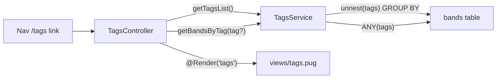

# Tags Feature — TDD Implementation Plan

## Context

- `Band.tags: string[]` column already exists, seeded, no migration needed.
- `views/Tags.pug` is already ported from legacy but **not wired** — capital `T` is also inconsistent with all other lowercase view files.
- `AppController` has a `// TODO tags` comment — the routes live there but are unimplemented.
- Nav menu entry and SCSS are already present.

## Data flow



## SQL queries

`getTagsList()` — PostgreSQL `unnest` equivalent of Mongo `$unwind + $group`:
```sql
SELECT tag AS name, COUNT(*) AS count
FROM bands, unnest(tags) AS tag
GROUP BY tag ORDER BY count DESC
```

`getBandsByTag(tag)`:
- Filtered: `WHERE $1 = ANY(tags)`
- All (no tag param): `WHERE array_length(tags, 1) > 0`

## New files

- `src/tags/tags.service.ts` — `getTagsList()` + `getBandsByTag(tag?)`
- `src/tags/tags.service.spec.ts` — unit tests (mock repo)
- `src/tags/tags.controller.ts` — `GET /tags`, `GET /tags/:tag`
- `src/tags/tags.module.ts` — `TypeOrmModule.forFeature([Band])`
- `test/tags.integration-spec.ts` — supertest against real app
- `e2e/pages/TagsPage.ts` — Page Object Model
- `e2e/specs/tags.spec.ts` — Playwright e2e spec

## Modified files

- [`src/app.module.ts`](src/app.module.ts) — import `TagsModule`, remove `// TODO tags` comment
- `views/Tags.pug` → rename to `views/tags.pug`; update `t._id → t.name` + `v._id → v.name`; add `data-testid`s
- [`.cursor/rules/data-testid-convention.mdc`](.cursor/rules/data-testid-convention.mdc) — register 4 new testids

## New data-testid registrations

| Test ID | Element |
|---|---|
| `tags.browse.heading` | `h2.title--tags` |
| `tags.browse.tags-list` | `ul.tags.tags--list` |
| `tags.browse.tag-link` | Each `a.tag__link` |
| `tags.browse.bands-container` | `.bands` div |

---

## Phase 1 — Service + unit tests

Write `tags.service.spec.ts` first (red), then `tags.service.ts` (green).

Unit test scaffold:
```typescript
describe('TagsService', () => {
  describe('getTagsList', () => {
    it('returns tags ordered by count descending');
    it('returns empty array when no tags exist');
  });
  describe('getBandsByTag', () => {
    it('returns all bands with tags when no tag param');
    it('returns only bands matching the given tag');
    it('returns empty array when tag matches nothing');
  });
});
```

Service method signatures:
```typescript
async getTagsList(): Promise<TagCount[]>
async getBandsByTag(tag?: string): Promise<Band[]>
```

Where `TagCount = { name: string; count: number }` — defined in the service file.

## Phase 2 — Controller + module + integration tests

Write `test/tags.integration-spec.ts` first, then implement.

Integration tests:
```typescript
describe('GET /tags', () => {
  it('returns 200');
  it('renders tags-list testid');
  it('renders bands-container testid');
  it('shows tag name from seeded band');
});
describe('GET /tags/:tag', () => {
  it('returns 200');
  it('renders only bands matching that tag');
  it('active class on the matching tag link');
});
```

Controller shape:
```typescript
@Controller()
export class TagsController {
  @Get('tags')
  @Render('tags')
  async browse() { ... }

  @Get('tags/:tag')
  @Render('tags')
  async browseByTag(@Param('tag') tag: string) { ... }
}
```

Both handlers return `{ title, tags, bands, tag? }`.

## Phase 3 — Template + e2e

1. Rename `Tags.pug` → `tags.pug`; update `t._id`/`v._id` references to `t.name`/`v.name`; add `data-testid` attributes.
2. Create `e2e/pages/TagsPage.ts` POM.
3. Write `e2e/specs/tags.spec.ts`:
   - Nav link navigates to `/tags`
   - Tags list renders with pick SVGs
   - Clicking a tag filters bands
   - Active class applied to selected tag

## Validation

After all phases are green:
```bash
npm run lint
npm run build
npm run test
npm run test:integration
npm run test:e2e
npx tsc --noEmit
```
